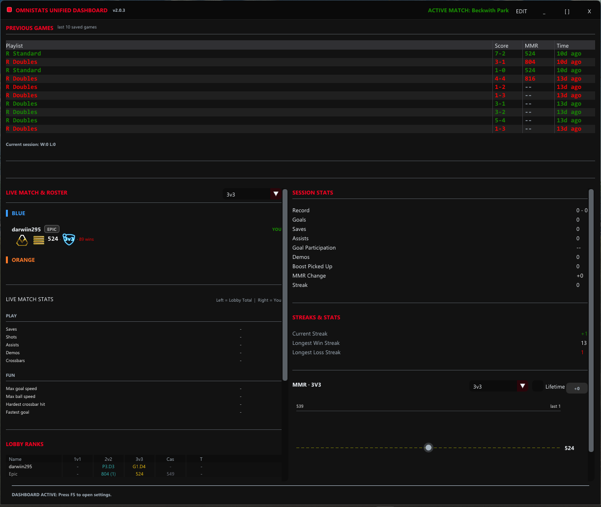
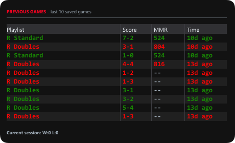
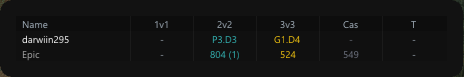
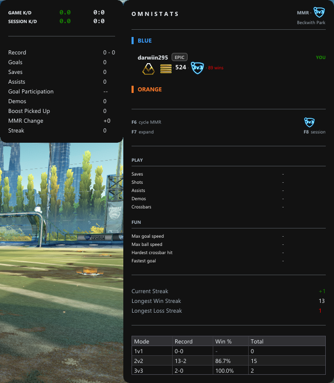

# OmniStats

OmniStats is a native Windows companion for Rocket League. It reads the local Stats API, tracks live match and session statistics, stores history locally, and renders a click-through overlay or second-monitor dashboard.

**Project status:** source available under the PolyForm Internal Use License 1.0.0. The source can be inspected, built for internal use, modified locally, and contributed back under the narrow exception in [CONTRIBUTION_EXCEPTION.md](CONTRIBUTION_EXCEPTION.md). Redistribution, unofficial release builds, public rebrands, mirrors, and competing distributions require written permission.

## Features

- Live match telemetry from Rocket League's loopback Stats API.
- Session and match statistics including score, goals, assists, saves, shots, demos, streaks, and records.
- Optional live public-rank lookup through Tracker Network.
- Local SQLite and JSONL history.
- Click-through overlay and second-monitor dashboard.
- Player roster context and browser links to public player profiles.
- Required startup diagnostics plus optional Discord Rich Presence, Ballchasing replay uploads, update checks, and crash reports.

OmniStats does not inject into Rocket League. Tracker rank lookup is an optional third-party integration and may stop working when Tracker Network changes its service.

## Screenshots

### Dashboard



### Match history



### Lobby



### Overlay



## Build and test

OmniStats targets Windows 10 or newer and uses C++20, CMake, MSVC, and vcpkg manifest mode. CI uses a fixed vcpkg release for consistent validation.

```powershell
$env:VCPKG_ROOT = 'C:\src\vcpkg'
cmake --preset windows-release
cmake --build --preset windows-release
ctest --preset windows-release
```

See [docs/BUILDING.md](docs/BUILDING.md) for setup details. Official packages use the WiX MSI; the old bootstrap installer has been retired. Current releases may be unsigned, so Windows can display an **Unknown publisher** or SmartScreen warning.

## Documentation

- [Architecture](docs/ARCHITECTURE.md)
- [Building](docs/BUILDING.md)
- [Privacy](docs/PRIVACY.md)
- [Contributing](CONTRIBUTING.md)
- [Security policy](SECURITY.md)
- [License](LICENSE)

## Contributing

Read [CONTRIBUTING.md](CONTRIBUTING.md), keep changes focused, and run the Release test preset. CI builds and tests every pull request.

## Privacy and updates

After the privacy notice is accepted, OmniStats sends required startup diagnostics containing the app version, a pseudonymous installation identifier, and feature-toggle status. Match data and player names are not included. Tracker rank lookup sends lobby player names and platform identifiers to Tracker Network only when enabled. Updates are downloaded over HTTPS and checked against published SHA-256 values.

## Official links

- Website: <https://omnistats.org/>
- Support: <https://discord.gg/4KBW35ApvF>

Rocket League, Psyonix, Epic Games, Tracker Network, Discord, GitHub, and ballchasing.com are marks of their respective owners. OmniStats is independent and is not affiliated with or endorsed by those services.
