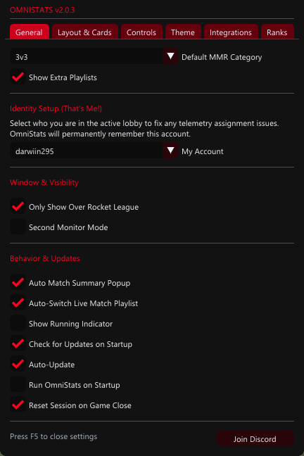

# OmniStats

OmniStats is a Windows desktop companion for Rocket League. It reads Rocket League's local Stats API, tracks live match and session statistics, shows roster rank/MMR context, and provides an in-game overlay or second-monitor dashboard.

OmniStats is source-available and contributor-friendly under the PolyForm Internal Use License 1.0.0 with the contribution exception in [CONTRIBUTION_EXCEPTION.md](CONTRIBUTION_EXCEPTION.md). Personal and internal use, local modification, and contributions to the official OmniStats project are allowed. Redistribution, mirrors, public rebrands, competing releases, and unofficial release builds require written permission.

## Features

- Live Rocket League match telemetry from the local Stats API.
- Roster rank, MMR, division, platform, encounter-history, and Tracker.gg context.
- Session and match statistics, including score, goals, assists, saves, shots, demos, streaks, and match records.
- Local SQLite and JSONL history storage.
- Click-through in-game overlay and second-monitor dashboard.
- Optional Tracker.gg MMR lookup, Discord Rich Presence, Ballchasing replay uploads, update checks, and crash reports.

## Screenshots

### Dashboard

### Match History

### Lobby Ranks

### Main Overlay

### Settings

## Requirements and build

OmniStats targets Windows 10 or newer and uses C++20, CMake, MSVC, and vcpkg. Follow the complete [build guide](docs/BUILDING.md).

For Rocket League telemetry, OmniStats defaults to `127.0.0.1:49123`; see [configuration](docs/CONFIGURATION.md) for the required Stats API settings.

## Documentation

- [Building](docs/BUILDING.md)
- [Configuration](docs/CONFIGURATION.md)
- [Privacy](docs/PRIVACY.md)
- [Troubleshooting](docs/TROUBLESHOOTING.md)
- [Security policy](SECURITY.md)
- [Trademark policy](TRADEMARKS.md)

## Contributing

Contributions to the official OmniStats project are welcome. Read [CONTRIBUTING.md](CONTRIBUTING.md), keep changes focused, run relevant tests, and never include secrets, logs, crash dumps, local configuration, generated binaries, or personal machine paths.

## License and project identity

The source code is licensed under the [PolyForm Internal Use License 1.0.0](LICENSE). The contribution exception permits the limited forks and patches needed to send changes to the official project. The OmniStats name, logo, icons, official services, and support channels are governed by [TRADEMARKS.md](TRADEMARKS.md).

## Privacy and security

OmniStats stores runtime data locally and keeps optional external integrations disabled until enabled by the user. Read [docs/PRIVACY.md](docs/PRIVACY.md) before enabling those features. Do not report vulnerabilities, exposed credentials, private logs, crash dumps, or privacy-sensitive bugs in public issues; follow [SECURITY.md](SECURITY.md).

## Official support

Community support: <https://discord.gg/4KBW35ApvF>

Rocket League, Tracker.gg, Discord, GitHub, and ballchasing.com are trademarks of their respective owners. OmniStats is not affiliated with or endorsed by those services.
